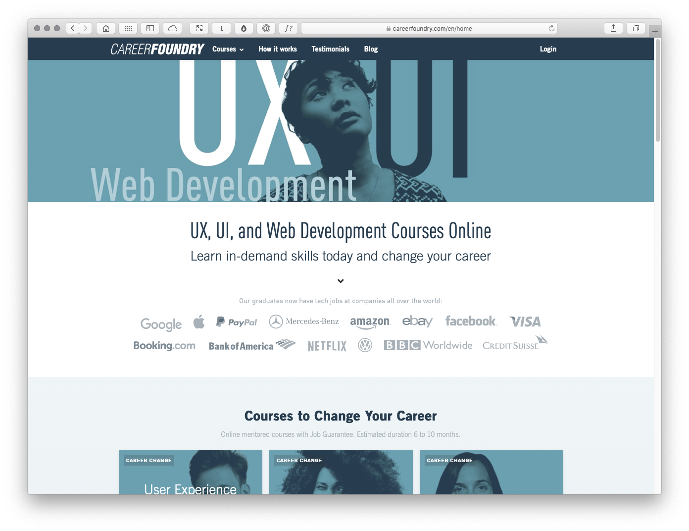
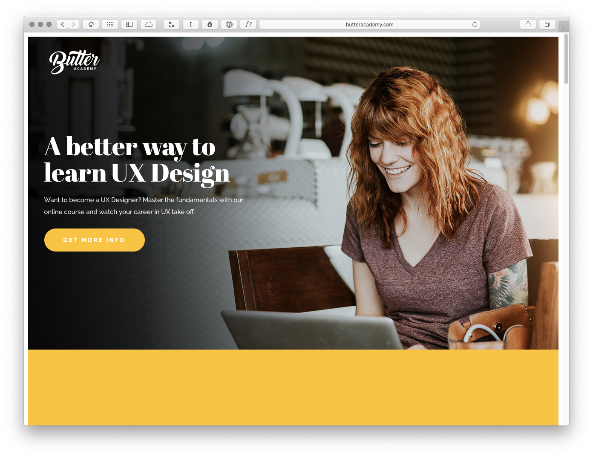
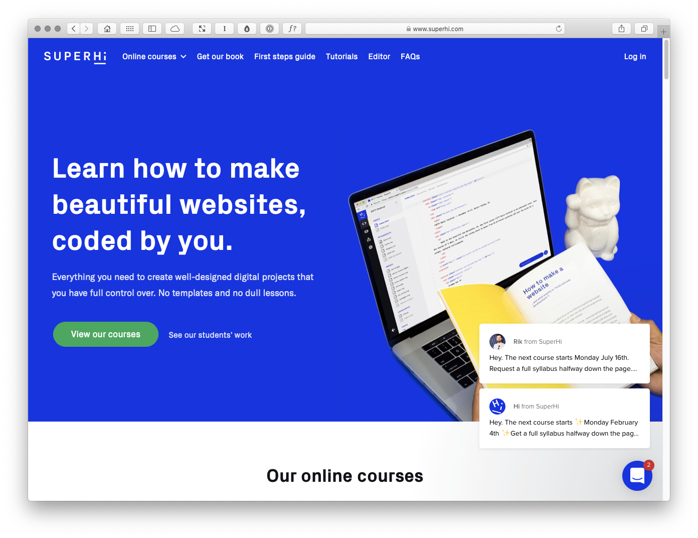
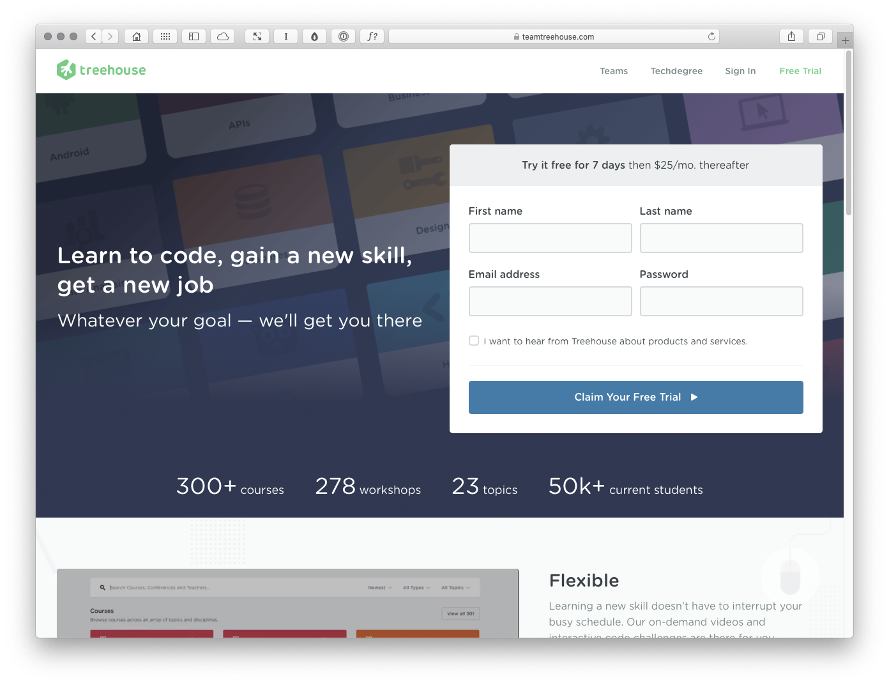
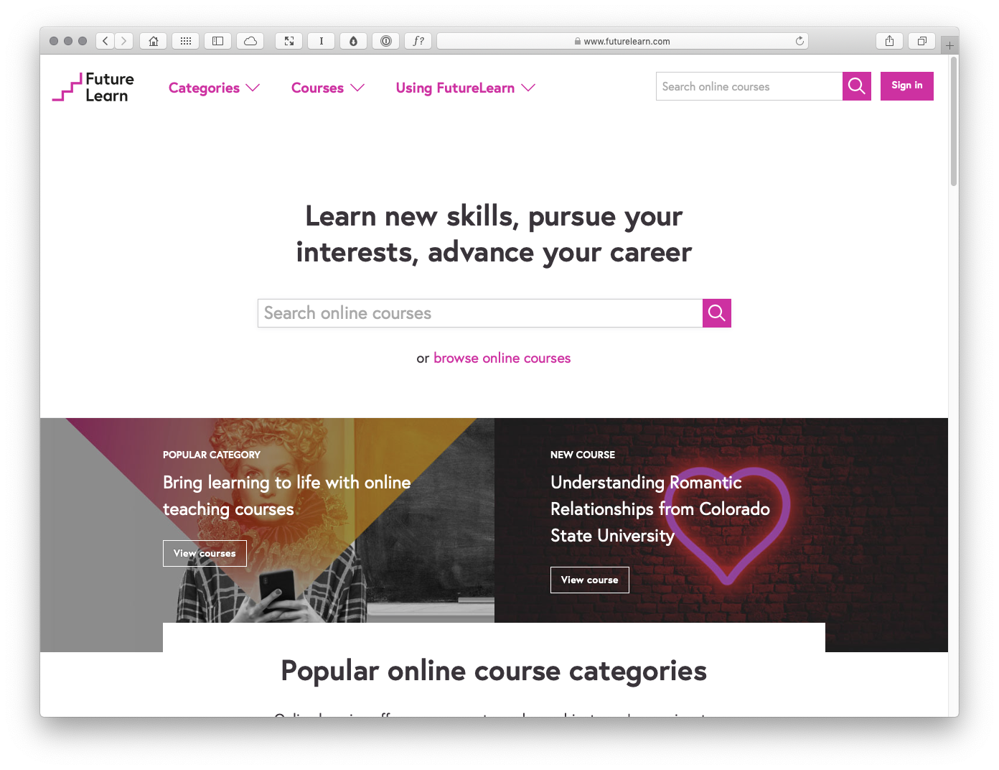

X School · Competitor Analysis
==============================

**This is a case study for the book Designing Delightful Experiences: A Practical Guide to User Experience Design.**

After an initial scoping exercise, which included a wider range of digital learning platforms (including Udemy, Coursera and the Open University), I focused in on five competitors for analysis:

+ CareerFoundry
+ Butter Academy
+ SuperHi
+ Treehouse
+ FutureLearn

For each of these products, I’ve focused on:

+ Voice and Tone
+ Branding and Aesthetic
+ Course Content
+ Pricing
+ Marketing

It could be argued that marketing is beyond the scope of a typical project, but I think it’s important to consider as it provides a sense of how different competitors share their product stories.

I’ve gathered together my research below (and I’ll be adding to this with a visually-driven slidedeck shortly). This isn’t exhaustive research. If I were doing this for a client, I’d go into **much more depth**.

CareerFoundry
-------------

	https://careerfoundry.com/

### Voice and Tone

CareerFoundry pitches itself as follows:

> Learn in-demand skills today and change your career.

The emphasis is very much on highlighting ‘in-demand’ skills and ‘changing your career’. This career-focused approach, coupled with the name, CareerFoundry, really underlines that the site’s target users have very clear goals in mind: Forging a new career.

The messaging is consistent throughout the site, with a strong emphasis on changing or enhancing your career, i.e. **studying with CareerFoundry is an investment**:

+ Courses to Change Your Career
+ Our Career Change Courses are designed as whole learning experiences to support your journey from the first exercise to a new career.
+ Online Mentored Courses With Job Guarantee

### Branding and Aesthetic

Overall, the branding and aesthetic is quite neutral (and a little on the serious side). The emphasis seems to be on **this is a site you can trust** and the site’s communicating **less fun-focused and more career-focused**.

### Course Content

Courses are broken down into two subsets: ‘Courses to Change Your Career’ and ‘Courses to Broaden Your Skill Set’. At a glance this suggests two different pricing tiers: changing career (£££); enhancing skills (£).

**Courses to Change Your Career**

+ UX Design
+ UI Design
+ Web Development

**Courses to Broaden Your Skill Set**

+ UX Fundamentals
+ Voice User Interface Design
+ UI for UX Designers
+ Frontend Development for Designers

### Pricing (UX Design)

+ One Off Payment: £4,749 Upfront (Save £250)
+ Monthly Payment Plan: £400 x 10 months + £999 Upfront

### Marketing

CareerFoundry prominently list ‘graduate destinations’, with a list of high profile companies graduates are now working for. **Our graduates now have tech jobs at companies all over the world:** Google, PayPal, Amazon, Facebook, Visa…

There’s a ‘Got questions?’ box in the footer with a prompt to ‘Ask Olivia’. There’s also a small call to action underneath this with a prompt to ‘Connect with a Career Advisor’ (this text is actually a link, although it doesn’t look like one).

Lastly, there’s an offer of a Free Webinar: “How to become a UX designer even if you don’t have previous tech or design skills.” There are also free email introductory courses, which presumably give a flavour of the teaching.

The overall messaging emphasises that almost anyone can take a course with CareerFoundry and change career.

Butter Academy
--------------

	http://butteracademy.com

### Voice and Tone

Butter Academy pitches itself as, “A better way to learn UX Design.” As they put it:

> Want to become a UX Designer? Master the fundamentals with our online course and watch your career in UX take off.

The language used is somewhat informal, with an emphasis on what you’ll learn. Some of the language used is a little concerning, like: “Start now, finish whenever.” This suggests a lack of urgency over completing the course.

Whilst it’s understandable that this course might be pitched as something to undertake in your own time, this emphasis on ‘finish whenever’ undermines confidence in the outcome.

+ No fluff or BS. You’ll get the skills you need to excel in UX Design.
+ You’ll learn how to create user-friendly websites and apps from scratch and solve real world business problems with design solutions.
+ Polished Portfolio Work.

### Branding and Aesthetic

The branding and aesthetic is underpinned by a strong colour palette (yellow) that gives the brand a clear sense of visual cohesion.

The photography used leans a little too much towards stock photography and all looks a little off-the-shelf. The imagery doesn’t suggest real people, rather an idealised picture.

The typography’s a mix of a serif (Abril Fatface) and sans serif (Raleway) type. The typographic palette coupled with the strong colour palette gives the site a very contemporary and consistent feel.

### Course Content

Course content is delivered through a combination of video lessons (18) and practical assignments (6) resulting in a **polished portfolio of work** and a **certificate of completion**. The course is broken down as follows: 

+ Fundamentals of UX Design
+ User Research
+ Information Architecture
+ Wireframes and Prototypes
+ Usability Testing
+ Final Project

### Pricing

+ $195

### Marketing

The site uses testimonials with what look like real photographs of real people. The testimonials are, however, a little on the short side. I think it would build believability to feature some more in-depth user recommendations.

There’s a list of brands on the home page (Virgin, BBVA, Nestlé…), but looking at the content these don’t appear to be graduate destinations, more the companies the course creator – Daniel Salgado – has worked for.

There’s a prominent ‘Get More Info’ call to action button that leads to a page with a simple form to submit your name and email address. Other than that, there appears to be very little other marketing.

- - -

**ANALYSIS NEEDS TO BE FINISHED BELOW HERE.**

- - -

SuperHi
-------

	https://www.superhi.com/

### Voice and Tone

TK

### Branding and Aesthetic

TK

### Course Content

TK

### Pricing

TK

### Marketing

TK

Treehouse
---------

### Voice and Tone

TK

### Branding and Aesthetic

TK

### Course Content

TK

### Pricing

TK

### Marketing

TK

FutureLearn
-----------

	https://www.futurelearn.com

### Voice and Tone

Futurelearn pitches itself as follows:

> Learn new skills, pursue your interests, advance your career.

### Branding and Aesthetic

The branding is clean and consistent with a very strong colour palette (pink) that’s used throughout the site. The iconography is very good, as is the typography, which is clean and consistent.

Look at the design patterns that are used, with different ‘modular blocks’ that are repeated:

+ Feature Courses
+ Smaller Menus of Courses

### Course Content

Look at the way course content is surfaced:

+ Popular Course
+ Important Topic

Although the content is considerable users are **eased in to it** with featured courses, with an accompanying ‘View all course categories’ link.

### Pricing

TK

### Marketing

TK